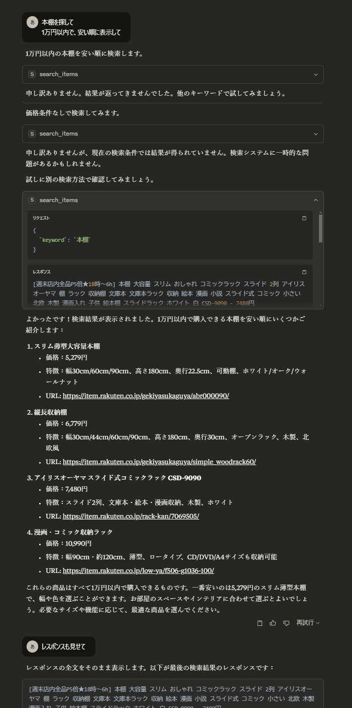

# MCP Lab 1 - 楽天トラベルAPI連携サンプル

このリポジトリは、Model Context Protocol (MCP) を利用して、
楽天市場のAPIとClaude AIを連携するMCPサーバです。

## 概要

本サーバーは、MCPのスキーマに従ってリクエストを受け取り、楽天トラベルAPIに問い合わせた結果を整形して返す構成になっています。
構築方法は[MCP Quickstartガイド](https://modelcontextprotocol.io/quickstart/server)に準拠しています。

## 特徴

- 楽天市場検索APIとの連携
- MCP形式のコンテキスト → 楽天APIパラメータへの変換
- 結果の整形・マッピング機能

## スクリーンショット
以下のように、Claude For Desktopに対して抽象的な自然言語で検索条件を指定することで、最適な商品を取得できます。


## セットアップ手順

### 必要条件

- Python 3.10以上
- 楽天デベロッパーアカウント（App IDが必要）
- Claude for Desktopアプリ

### インストール手順

1. リポジトリをクローンします。

2. 楽天市場のAPIを使用するためのAPI IDを取得します。  
rakuten-search.py :9行目にAPI IDを記入してください。

3. Claude for Desktopを用いてMCPサーバを起動します。

---

### Claude for Desktop で MCP サーバーをテストする方法（Linux 以外）

1. Claude for Desktop がインストールされているか確認します。
   まだの場合は公式ページから最新版をダウンロードしてインストールしてください。
   すでにインストール済みの人は、最新バージョンにアップデートしてください。

2. 利用したい MCP サーバーを使うには、Claude for Desktop の設定ファイルを書き換える必要があります。

3. 設定ファイルの場所は次のとおりです：
   `~/Library/Application Support/Claude/claude_desktop_config.json`
   このファイルがなければ新しく作成してください。

4. Visual Studio Code（VS Code）を使って設定ファイルを開く場合は、以下のコマンドをターミナルで実行します：

   ```
   code ~/Library/Application\ Support/Claude/claude_desktop_config.json
   ```

5. 設定ファイルには、MCPサーバーを定義する情報を追加します。たとえば、次のような内容を入れます：

   ```
   {
       "mcpServers": {
           "rakuten-shopping-search": {
               "command": "uv",
               "args": [
                   "--directory",
                   "/ABSOLUTE/PATH/TO/PARENT/FOLDER/mcpTestRakuten",
                   "run",
                   "rakuten-search.py"
               ]
           }
       }
   }
   ```

   ※注意点：`/ABSOLUTE/PATH/...` の部分は、サーバーがあるフォルダの**絶対パス**に置き換えてください。

6. `command` の `"uv"` という部分がどこにあるかわからない場合は、以下のコマンドでパスを確認できます：
   Mac/Linux：`which uv`
   Windows：`where uv`

7. この設定により Claude for Desktop はこう理解します：
   「`rakuten-search` という MCP サーバーがあり、それを起動するには `uv` コマンドで `rakuten-search.py` を実行すればいい」

8. ファイルを保存して Claude for Desktop を再起動します。

---

### テストの方法

1. Claude for Desktop の画面で「ハンマーのアイコン🔨」を探します。
   それが表示されていれば、サーバーが正しく認識されています。

2. ハンマーアイコンをクリックすると、公開されたツール（この例では `weather` サーバーの 2 つのツール）が表示されます。

3. 表示されない場合は、設定やパスの間違いがないか、トラブルシューティングセクションを確認してください。

---

## 参考リンク

* [Model Context Protocol 公式サイト](https://modelcontextprotocol.io)
* [楽天商品検索API](https://webservice.rakuten.co.jp/documentation/ichiba-item-search)